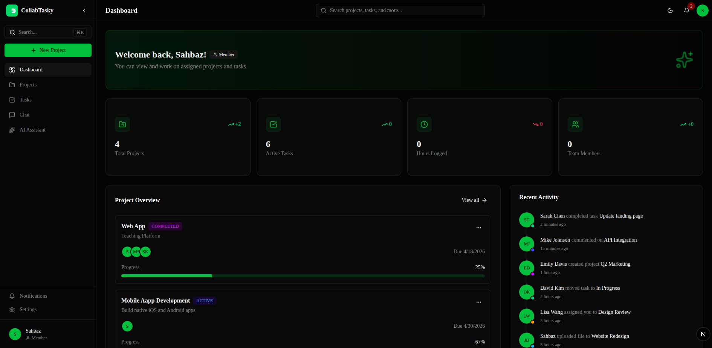
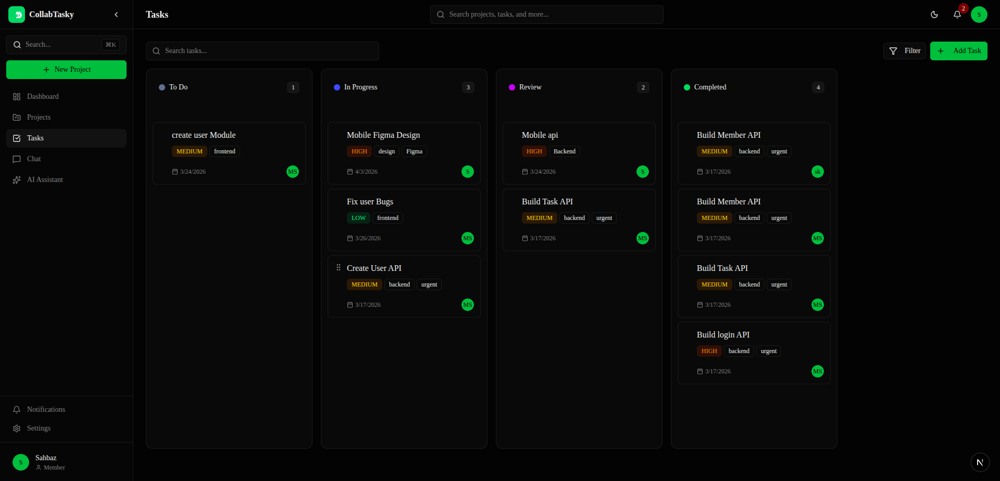

<div align="center">

# CollabTasky — Frontend

**A real-time collaborative project management platform powered by AI**

[](https://nextjs.org/)
[](https://www.typescriptlang.org/)
[](https://tailwindcss.com/)
[](https://react.dev/)
[](https://socket.io/)
[](https://www.docker.com/)

</div>

---

## What Is CollabTasky?

CollabTasky is a **full-stack SaaS-style project management tool** where teams can collaborate in real time — managing projects, assigning tasks, chatting with teammates, and getting AI-powered assistance — all in a single unified workspace.

> Built to solve the problem of scattered tools: no more switching between Trello for tasks, Slack for chat, and ChatGPT for help.

---

## Screenshots

|              Dashboard               |          Kanban Board          |
| :----------------------------------: | :----------------------------: |
|  |  |

---

## Key Features

### Project & Task Management

- Create and manage multiple projects with color labels and status tracking
- Kanban-style task board — `Todo` → `In Progress` → `Review` → `Completed`
- Set task priority (Low / Medium / High), due dates, tags, and assignees
- Task comments for inline team discussions

### Real-Time Collaboration

- **Live chat per project** — Socket.IO-powered room-based messaging
- **Direct messaging** between team members with conversation threads
- Online presence indicators and **live typing indicators**
- In-app notifications for new messages

### AI Assistant

- **Global AI chat** powered by Groq's LLaMA 3.3 70B model
- **Project-aware AI** — asks about your actual tasks and project context
- Supports: planning, feature breakdown, code help, documentation, roadmap creation

### Authentication & Teams

- JWT-based auth with secure login/signup flows
- Role-based access control: `Owner`, `Admin`, `Member`
- Team management panel per project

### UI/UX

- Fully responsive with dark/light theme toggle
- Built with **shadcn/ui** component library (Radix UI primitives)
- Data visualization dashboards via Recharts
- Accessible forms with React Hook Form + Zod validation

---

## Tech Stack

| Layer            | Technology              |
| ---------------- | ----------------------- |
| Framework        | Next.js 16 (App Router) |
| Language         | TypeScript 5.7          |
| Styling          | Tailwind CSS v4         |
| Components       | shadcn/ui + Radix UI    |
| State / Context  | React Context API       |
| Forms            | React Hook Form + Zod   |
| Real-time        | Socket.IO Client        |
| HTTP             | Axios                   |
| Charts           | Recharts                |
| Theme            | next-themes             |
| Analytics        | Vercel Analytics        |
| Containerization | Docker                  |

---

## Project Structure

```
collabTasky-Frontend/
├── app/
│   ├── (auth)/
│   │   ├── login/
│   │   └── signup/
│   └── (dashboard)/
│       ├── dashboard/       # Overview & analytics
│       ├── projects/        # Project list + detail [id]
│       ├── tasks/           # All tasks view
│       ├── chat/            # Real-time project chat
│       ├── team/            # Team members
│       ├── ai/              # AI assistant
│       ├── notifications/
│       └── settings/
├── components/
│   ├── ui/                  # shadcn/ui primitives
│   ├── dashboard/
│   ├── tasks/
│   ├── projects/
│   ├── team/
│   └── layout/
└── src/
    ├── contexts/            # Auth, Socket, Theme context
    ├── hooks/               # Custom React hooks
    ├── services/            # Axios API service layer
    ├── types/               # TypeScript interfaces
    └── lib/                 # Utility functions
```

---

## Getting Started

### Prerequisites

- Node.js ≥ 18
- Backend API running (see [collabTasky-backend](../collabTasky-backend))

### Installation

```bash
# Clone the repository
git clone https://github.com/mdsahbazkhan/CollabTasky.git
cd collabTasky-Frontend

# Install dependencies
npm install
# or with pnpm
pnpm install
```

### Environment Variables

Create a `.env.local` file in the root:

```env
NEXT_PUBLIC_API_URL=http://localhost:5000
NEXT_PUBLIC_SOCKET_URL=http://localhost:5000
```

### Running Locally

```bash
# Development server
npm run dev

# Production build
npm run build
npm run start
```

Open [http://localhost:3000](http://localhost:3000) in your browser.

### With Docker

```bash
# From the root of the monorepo
docker build -t collabtasky-frontend . 

docker run -p 5000:5000 collabtasky-frontend
```

### Live Deployment

```
Frontend API: https://collab-tasky.vercel.app/
```

---

## Architecture Decisions

**Why Next.js App Router?**
Server components reduce client-side JS bundle, and route groups `(auth)` / `(dashboard)` cleanly enforce layout separation without extra wrappers.

**Why Socket.IO over raw WebSockets?**
Automatic reconnection, room-based broadcasting, and fallback transports made it the practical choice for real-time chat and notifications.

**Why Zod + React Hook Form?**
Type-safe schema validation shared between form state and API payloads eliminates duplicate validation logic.

---

## Deployment

The frontend is optimized for **Vercel** deployment with Vercel Analytics pre-configured. Docker support is also included for self-hosted environments.

---

<div align="center">

**[Backend Repo](../collabTasky-backend)** · Built with passion by Sahbaz Alam

</div>
